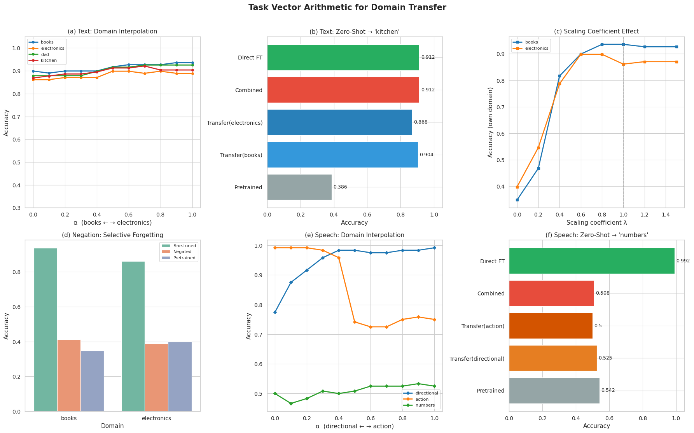

# Task Vector Arithmetic for Domain Transfer

Weight-space manipulation of transformer-based text and speech classification models. Fine-tuning on distinct domains, computing weight-space deltas (task vectors), and transferring domain-specific capabilities without retraining.

Based on: Ilyas et al., [*Editing Models with Task Arithmetic*](https://arxiv.org/abs/2212.04089) (ICLR 2023)

## Overview

A **task vector** is the difference between a fine-tuned model's weights and the pretrained model's weights:

```
τ = θ_finetuned − θ_pretrained
```

Once extracted, these vectors support arithmetic operations in weight space:

| Operation | Formula | Effect |
|-----------|---------|--------|
| **Addition** | θ_pre + τ | Recovers fine-tuned behaviour |
| **Negation** | θ_pre − τ | Selectively removes domain knowledge |
| **Scaling** | θ_pre + λ·τ | Controls transfer strength |
| **Interpolation** | θ_pre + α·τ_A + (1−α)·τ_B | Blends two domain behaviours |
| **Transfer** | θ_pre + τ_A (eval on domain C) | Zero-shot domain adaptation |

## Experiments

### Experiment 1: Text Classification (DistilBERT)

**Task:** Binary sentiment classification on Amazon product reviews across four domains — books, electronics, dvd, kitchen.

- Fine-tuned on **books** and **electronics**
- Held out **kitchen** for zero-shot transfer evaluation

**Key Results:**

| Method | Kitchen Accuracy | Compute Cost |
|--------|:---:|:---:|
| Pretrained (no fine-tuning) | 0.386 | — |
| Transfer from books | 0.904 | ~0s |
| Transfer from electronics | 0.868 | ~0s |
| Combined transfer (avg) | **0.912** | ~0s |
| Direct fine-tuning on kitchen | **0.912** | ~23s |

> Combined task vector transfer **matches direct fine-tuning** at zero additional compute cost.

### Experiment 2: Speech Classification (Wav2Vec2)

**Task:** Binary classification on Google Speech Commands v0.02 across three command groups — directional (up/down/left/right), action (go/stop/yes/no), numbers (one/two/three/four).

- Fine-tuned on **directional** and **action**
- Held out **numbers** for zero-shot transfer evaluation

**Key Findings:**
- Interpolation between directional and action vectors produces smooth domain transitions (directional: 0.78 → 0.99, action: 0.99 → 0.75 as α varies from 0 to 1)
- Zero-shot transfer to numbers was limited (~0.50-0.53) due to acoustic dissimilarity between domains — a valid negative result consistent with the hypothesis that transfer works best between related domains

### Additional Experiments

- **Negation:** Subtracting a domain's task vector degrades that domain's accuracy (books: 0.94 → 0.41) while leaving other domains relatively stable
- **Scaling coefficient:** Performance peaks near λ=0.8–1.0 and degrades at extreme values, validating that the task vector captures a meaningful direction in weight space
- **Cosine similarity:** cos(τ_books, τ_electronics) = 0.50, cos(τ_directional, τ_action) = 0.47 — related but distinct domains

## Results



Six-panel figure showing: (a) text interpolation curves, (b) text zero-shot transfer comparison, (c) scaling coefficient effect, (d) negation selective forgetting, (e) speech interpolation curves, (f) speech zero-shot transfer comparison.

## How to Run

1. Open `Task_Vector_Arithmetic_for_Domain_Transfer.ipynb` in [Google Colab](https://colab.research.google.com/)
2. Set runtime to **GPU** (Runtime → Change runtime type → T4 GPU)
3. Run all cells sequentially
4. Total runtime: ~25–30 minutes on a T4 GPU

## Tech Stack

- **Python** — core language
- **PyTorch** — model training and weight manipulation
- **HuggingFace Transformers** — pretrained DistilBERT and Wav2Vec2 models
- **HuggingFace Datasets** — Amazon Reviews Multi and Google Speech Commands v0.02
- **NumPy** — numerical operations
- **Scikit-learn** — evaluation metrics (accuracy, precision, recall, F1, confusion matrix)
- **Matplotlib / Seaborn** — visualisation

## Core Implementation

The `TaskVector` class implements weight-space arithmetic:

```python
class TaskVector:
    def __init__(self, pretrained_sd, finetuned_sd):
        # τ = θ_finetuned − θ_pretrained
        self.vector = {k: finetuned_sd[k] - pretrained_sd[k] for k in pretrained_sd}

    def apply_to(self, pretrained_sd, scaling_coeff=1.0):
        # θ_new = θ_pretrained + λ · τ
        return {k: pretrained_sd[k] + scaling_coeff * self.vector[k] for k in pretrained_sd}

    def __neg__(self):       # Negation: −τ
    def __add__(self, other): # Addition: τ_A + τ_B
    def __mul__(self, scalar): # Scaling: λ · τ

    @staticmethod
    def interpolate(tv_a, tv_b, alpha):
        # τ_interp = α · τ_A + (1 − α) · τ_B
        return alpha * tv_a + (1 - alpha) * tv_b
```

## Reference

```bibtex
@inproceedings{ilyas2023editing,
  title={Editing Models with Task Arithmetic},
  author={Ilyas, Andrew and Park, Sung Min and Engstrom, Logan and Leclerc, Guillaume and Madry, Aleksander},
  booktitle={International Conference on Learning Representations},
  year={2023}
}
```
